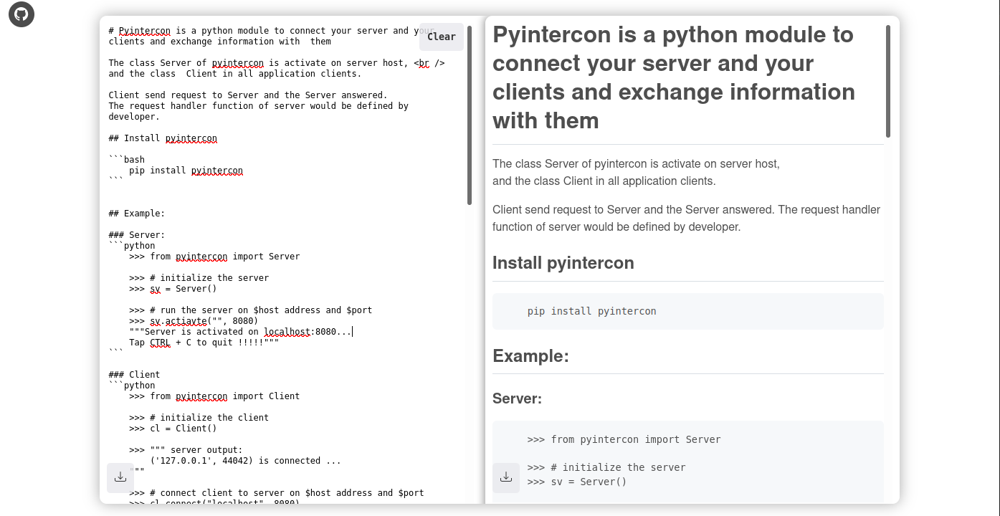

# MDEDITOR (Markdown-editor): Interactive markdown editor
> made with React.js and Node.js


<center>MDEDITOR UI</center>


#### Note:
* > Makrdown text is stored in <u>**_local storage_**</u>, so, after closing the current tab and opening new tab **your text is still appears**.

* > Possibility to download **.md** file for your markdown text <br/>
and download **.html** file for her preview.


## To run this project

### Clone this repo

``` bash
git clone https://github.com/ridoineel/markdown-editor
```

### Run frontend

``` bash
cd markdown-editor/frontend
npm start
```

### Run backend server
**(_it's mandatory_)**

``` bash
cd markdown-editor/backend
npm start
```
